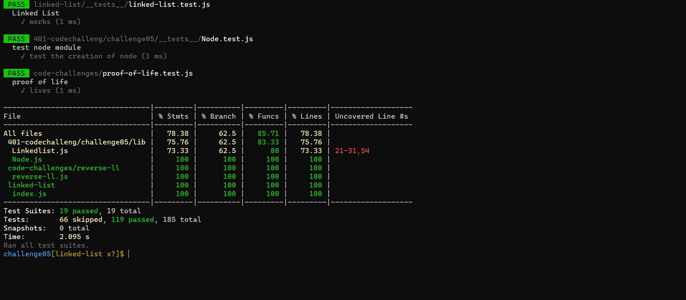

# Singly Linked List

*A Linked List is a sequence of Nodes that are connected/linked to each other. The most defining feature of a Linked List is that each Node references the next Node in the link.*

## Challenge
- create a Node class to creat nodes to be connected later to linked list .
- create linkedlist class that will use to create an empty linkedlist.
- define the methods that will used to have an action on the linkedlist    nodes .  insert(), includes(), tostring().

- add testing unites to the code to handle :
 
  - Can successfully instantiate an empty linked list
  - Can properly insert into the linked list
  - The head property will properly point to the first node in the linked list
  - Can properly insert multiple nodes into the linked list
  - Will return true when finding a value within the linked list that exists
  - Will return false when searching for a value in the linked list that does not exist
  - Can properly return a collection of all the values that exist in the linked list 

## Approach & Efficiency
- understood the problem domain  
- try to solve by writing the alqorithm to cover each part of the solution
- convrert it to the code .
- do test to make sure every thing is working fine

## API
- insert(): to insert nodes in the linkedlist starting from begining 
- append(): to insert nodes in the linkedlist starting from the last node
- includes(): to search for specific value in the linked list
- to string(): to convert the values in the linked list string values.

## testing result localy:

