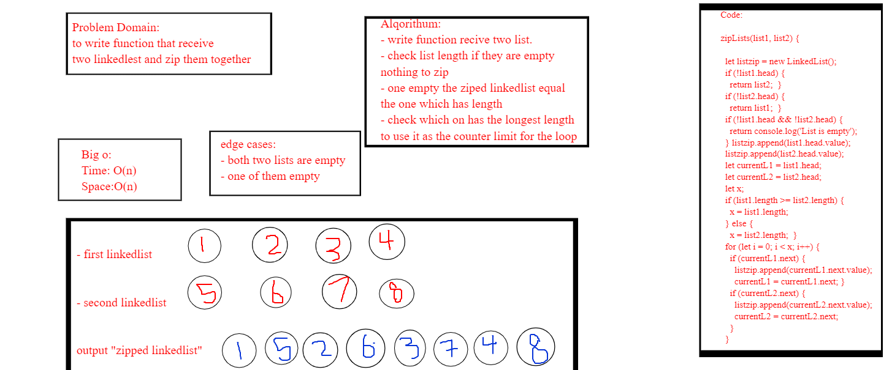
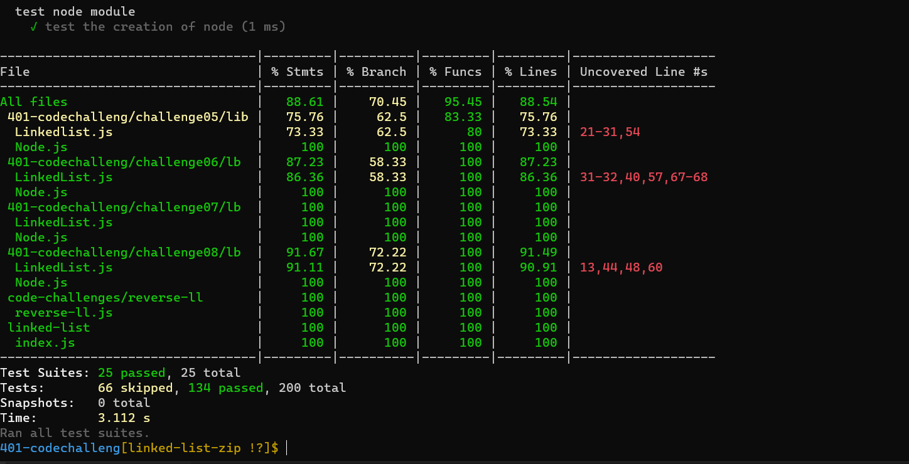

# Challenge Summary

**Write a function called zip lists**
 - Arguments: 2 linked lists 
 - Return: Linked List, zipped as noted below
 - Zip the two linked lists together into one so that the nodes alternate between the two lists and return a reference to the head of the zipped list.
  - Try and keep additional space down to O(1)
  - You have access to the Node class and all the properties on the Linked List class as well as the methods created in previous challenges.
## Whiteboard Process
<!-- Embedded whiteboard image -->

## Approach & Efficiency
<!-- What approach did you take? Why? What is the Big O space/time for this approach? -->
 ### big o:
 *Time: O(n)*
 *space:o(n)*

## Solution
<!-- Show how to run your code, and examples of it in action -->
