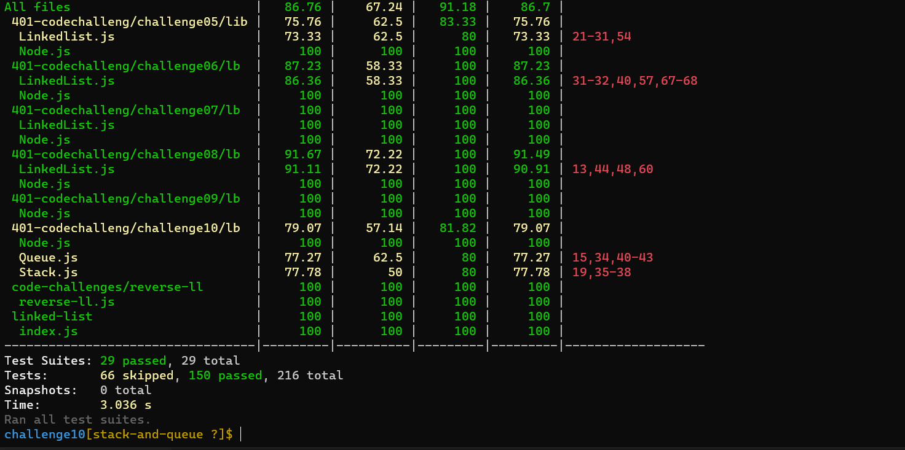

# Stacks and Queues
<!-- Short summary or background information -->
- Stacks: is a data structure that consists of Nodes. Each Node references the next Node in the stack, but does not reference its previous.
- Queues:  is a data structure that consists of Nodes
## Challenge
<!-- Description of the challenge -->
## Stack

- Create a Stack class that has a top property. It creates an empty Stack when instantiated.
  - This object should be aware of a default empty value    assigned to top when the stack is created.
  -  The class should contain the following methods:

      - push
        - Arguments: value
        - adds a new node with that value to the top of the stack with an O(1) Time performance.

      - pop
        - Arguments: none
        - Returns: the value from node from the top of the stack
        - Removes the node from the top of the stack
        - Should raise exception when called on empty stack
      - peek
         - Arguments: none
         - Returns: Value of the node located at the top of the stack
         - Should raise exception when called on empty stack

      - is empty
          - Arguments: none
          - Returns: Boolean indicating whether or not the stack is empty.
## Queue
 - Create a Queue class that has a front property. It creates an empty Queue when instantiated.
 - This object should be aware of a default empty value assigned to front when the queue is created.
 - The class should contain the following methods:

    - enqueue 
      - Arguments: value
      - adds a new node with that value to the back of the queue with an O(1) Time performance.

    - dequeue

       - Arguments: none
       - Returns: the value from node from the front of the queue
       - Removes the node from the front of the queue
       - Should raise exception when called on empty queue

    - peek

         - Arguments: none
         - Returns: Value of the node located at the front of the queue
         - Should raise exception when called on empty stack
    - is empty

       - Arguments: none
       - Returns: Boolean indicating whether or not the queue is empty
       - You have access to the Node class and all the properties on the Linked List class.

## Structure and Testing

*Utilize the Single-responsibility principle: any methods you write should be clean, reusable, abstract component parts to the whole challenge. You will be given feedback and marked down if you attempt to define a large, complex algorithm in one function definition.*

**Write tests to prove the following functionality:**

- Can successfully push onto a stack
- Can successfully push multiple values onto a stack
- Can successfully pop off the stack
- Can successfully empty a stack after multiple pops
- Can successfully peek the next item on the stack
- Can successfully instantiate an empty stack
- Calling pop or peek on empty stack raises exception
- Can successfully enqueue into a queue
- Can successfully enqueue multiple values into a queue
- Can successfully dequeue out of a queue the expected value
- Can successfully peek into a queue, seeing the expected value
- Can successfully empty a queue after multiple dequeues
- Can successfully instantiate an empty queue
- Calling dequeue or peek on empty queue raises exception

## Approach & Efficiency
<!-- What approach did you take? Why? What is the Big O space/time for this approach? -->
Big o:

*Time:O(1)*

*Space:o(1)*

## API
<!-- Description of each method publicly available to your Stack and Queue-->
- Enqueue - Nodes or items that are added to the queue.
- Dequeue - Nodes or items that are removed from the queue. If called when the queue is empty an exception will be raised.

- Peek - When you peek you will view the value of the front Node in the queue. If called when the queue is empty an exception will be raised.
- IsEmpty - returns true when queue is empty otherwise returns false.
- Push : ushing a Node onto a stack
- pop: Popping a Node off a stack  is the action of removing a Node from the top
- Peek : it will only be inspecting the top Node of the stack.
- IsEmpty : to check if the stack is empty 

## Test:

