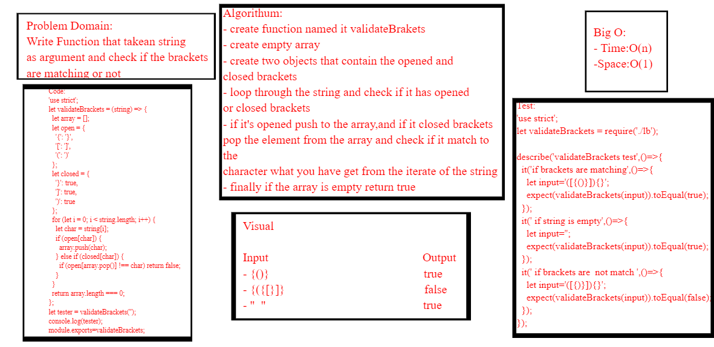
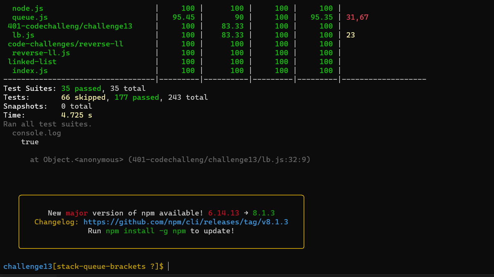

# Challenge Summary

- Write a function called validate brackets
- arguments: string
- Return: boolean
   - representing whether or not the brackets in the string are balanced

- There are 3 types of brackets:
  - Round Brackets : `()`
  - Square Brackets : `[]`
  - Curly Brackets : `{}`
## Whiteboard Process
<!-- Embedded whiteboard image -->

## Approach & Efficiency
<!-- What approach did you take? Why? What is the Big O space/time for this approach? -->
 ### big o:
 *Time: O(n)*
 
 *space:o(1)*

## Solution
<!-- Show how to run your code, and examples of it in action -->
