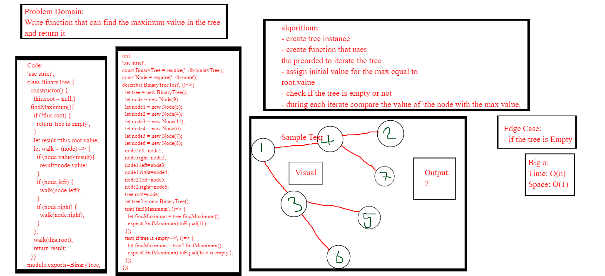
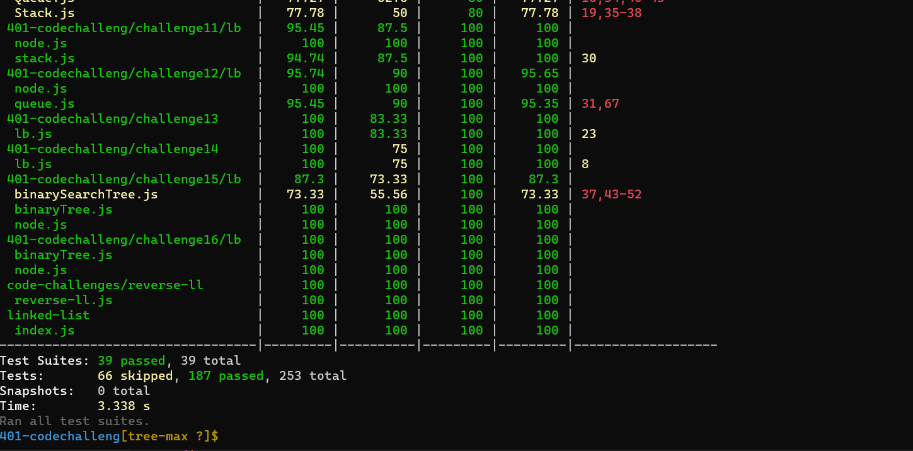

# Challenge Summary

- Write the following method for the Binary Tree class

 - find maximum value
    - Arguments: none
    - Returns: number
    - Find the maximum value stored in the tree. You can assume that the values stored in the Binary Tree will be numeric.
## Whiteboard Process
<!-- Embedded whiteboard image -->

## Approach & Efficiency
<!-- What approach did you take? Why? What is the Big O space/time for this approach? -->
 ### big o:
 *Time: O(n)*
 
 *space:o(1)*

## Solution
<!-- Show how to run your code, and examples of it in action -->
