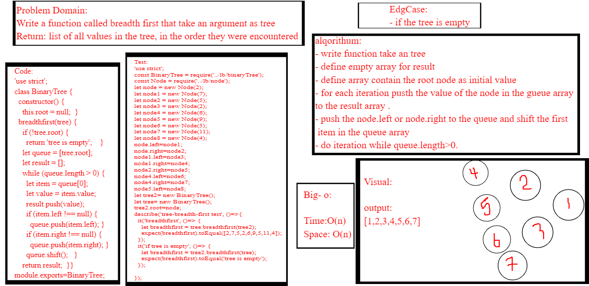
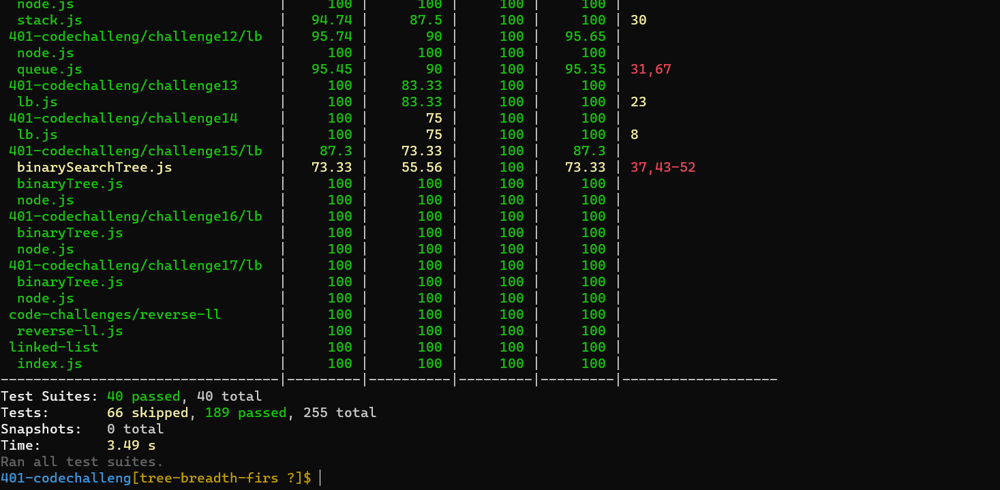

# Challenge Summary

- Write a function called breadth first
- Arguments: tree
- Return: list of all values in the tree, in the order they were encountered
## Whiteboard Process
<!-- Embedded whiteboard image -->

## Approach & Efficiency
<!-- What approach did you take? Why? What is the Big O space/time for this approach? -->
 ### big o:
 *Time: O(n)*
 
 *space:o(n)*

## Solution
<!-- Show how to run your code, and examples of it in action -->
