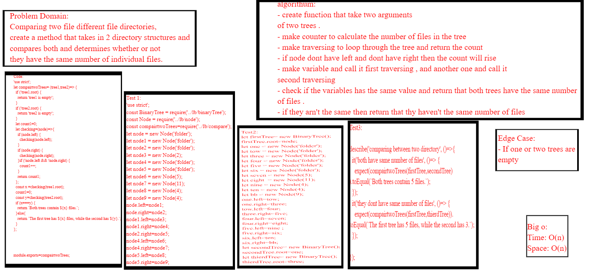
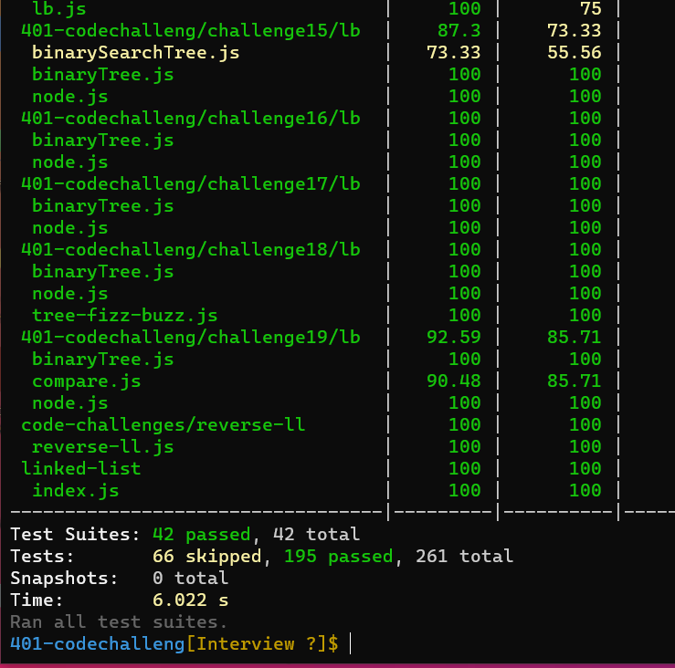

# Challenge Summary

**write a function to Comparing two file different file directories, create a method that takes in 2 directory structures and compares both and determines whether or not they have the same number of individual files.**

## rubric 
 [rubric](https://docs.google.com/spreadsheets/d/1ulsafpD1cGOvTw5Y9ipo6O2mrMNE7YXt7nCSsxYKoCY/edit#gid=0)
## Whiteboard Process
<!-- Embedded whiteboard image -->

## Approach & Efficiency
<!-- What approach did you take? Why? What is the Big O space/time for this approach? -->
 ### big o:
 *Time: O(n)*
 
 *space:o(n)*

## Solution
<!-- Show how to run your code, and examples of it in action -->
