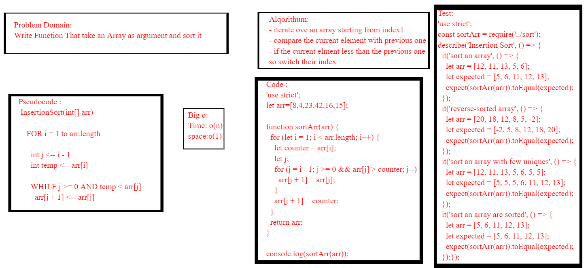
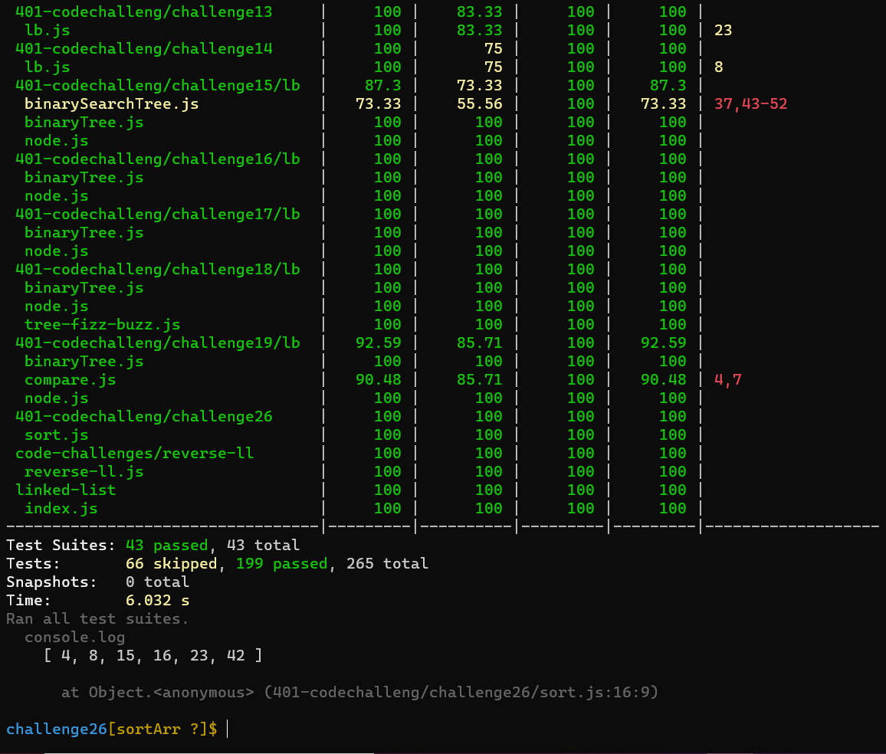

# Challenge Summary
*Review the pseudocode below, then trace the algorithm by stepping through the process with the provided sample array. Document your explanation by creating a blog article that shows the step-by-step output after each iteration through some sort of visual.*

*Once you are done with your article, code a working, tested implementation of Insertion Sort based on the pseudocode provided.*
## Whiteboard Process
<!-- Embedded whiteboard image -->

## Approach & Efficiency
<!-- What approach did you take? Why? What is the Big O space/time for this approach? -->
 ### big o:
 *Time: O(n)*
 
 *space:o(1)*

## Solution
<!-- Show how to run your code, and examples of it in action -->
