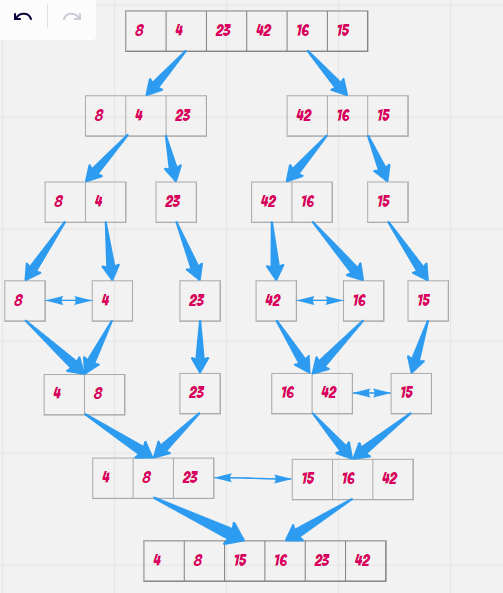
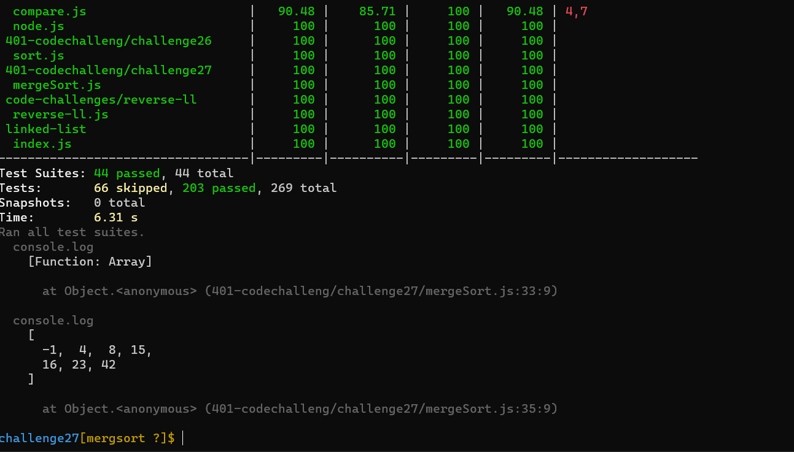

# Challenge Summary
*Merge Sort is a Divide and Conquer algorithm. It divides the input array into two halves, calls itself for the two halves, and then merges the two sorted halves. The merge() function is used for merging two halves. The merge(arr, l, m, r) is a key process that assumes that arr[l..m] and arr[m+1..r] are sorted and merges the two sorted sub-arrays into one. See the following C implementation for details.*

*It divides the input array into two halves, calls itself for the two halves, and then merges the two sorted halves. The merge() function is used for merging two halves. The merge(arr, l, m, r) is a key process that assumes that arr[l..m] and arr[m+1..r] are sorted and merges the two sorted sub-arrays into one. See the following C implementation for details.*

## Trace

### Sample Array: [8,4,23,42,16,15]

Steps:

- divide array into two parts left and right.

- divide each part into two part.

- keep dividing until each part has one element

- comparing if left element is less or equal right element then assign min element to current.

- if left is empty,then set remaining entries in arr to remaining values in right

- if right is empty,then set remaining entries in arr to remaining values in left

merge sort array [4,8,15,16,23,42]
## Approach & Efficiency
<!-- What approach did you take? Why? What is the Big O space/time for this approach? -->
 ### big o:
 *Time: O(n*log n)*
 
 *space:o(n)*

## Solution
<!-- Show how to run your code, and examples of it in action -->
