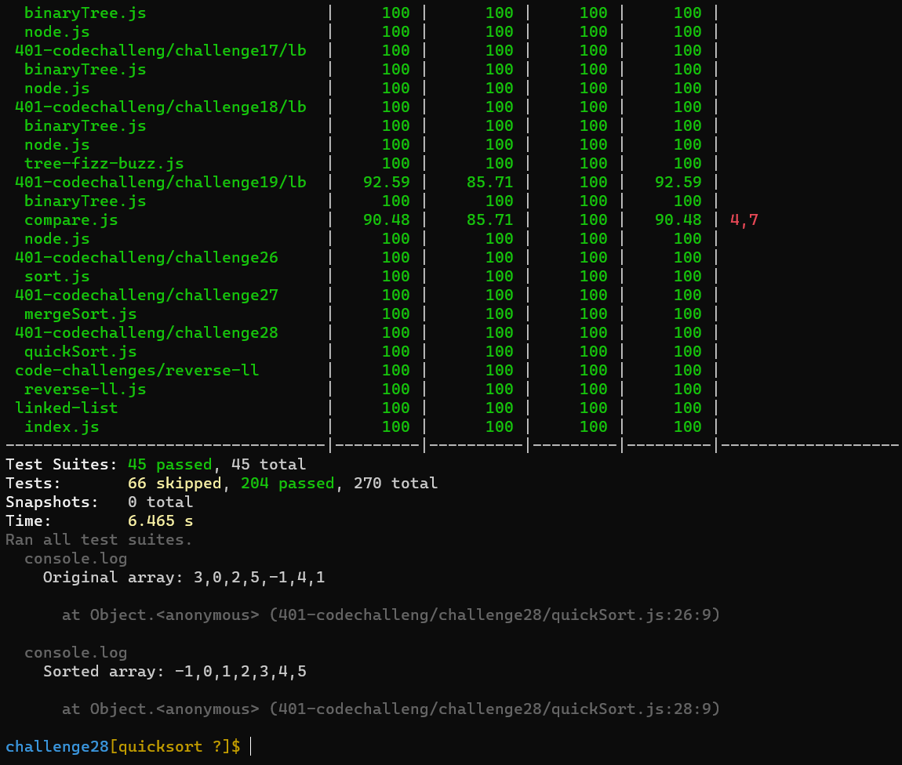

# Challenge Summary
*QuickSort is a Divide and Conquer algorithm. It picks an element as pivot and partitions the given array around the picked pivot.*

## Trace
### Sample Array: [8,4,23,42,16,15]

Steps:

- Choose the highest index value has pivot

- Take two variables to point left and right of the list excluding pivot

- left points to the low index

- right points to the high

- while value at left is less than pivot move right

- while value at right is greater than pivot move left

- if both step 5 and step 6 does not match swap left and right

- if left ≥ right, the point where they met is new pivot

**Quick sort array [4,8,15,16,23,42]**

## Approach & Efficiency
<!-- What approach did you take? Why? What is the Big O space/time for this approach? -->
 ### big o:Efficency:
- Best Time Complexity : O(nlogn)
- Average Time Complexity : O(nlogn)
- Worst Time Complexity : O(n^2)
- Space Complexity: O(1).
## Solution
<!-- Show how to run your code, and examples of it in action -->
