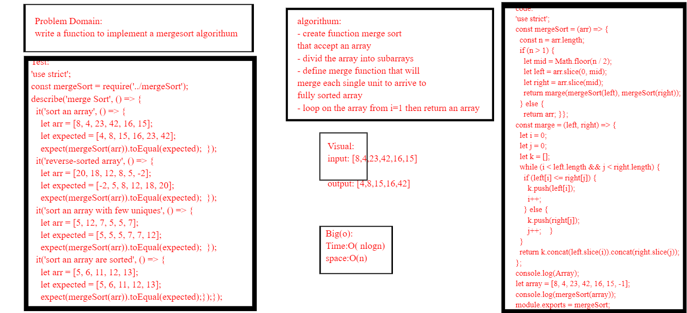
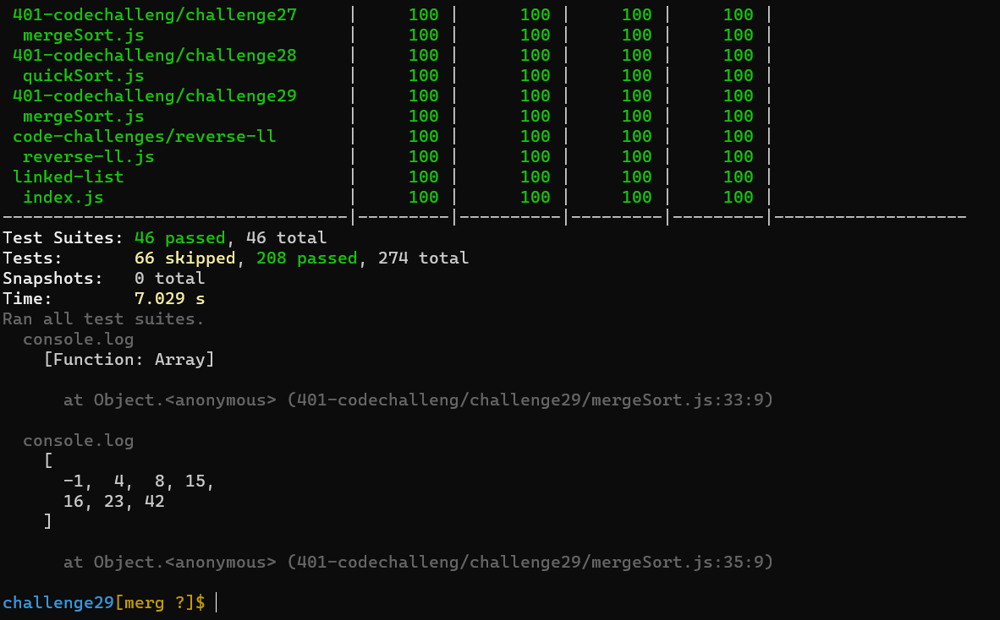

# Challenge Summary

*write a function to implement a mergesort.*

## rubric 
 [rubric](https://docs.google.com/spreadsheets/d/1F1sK_6SUpCk9n2XvYBGbypGhhF940yuIFD6gPL5dlL4/edit#gid=1448977519)
## Whiteboard Process
<!-- Embedded whiteboard image -->

## Approach & Efficiency
<!-- What approach did you take? Why? What is the Big O space/time for this approach? -->
 ### big o:
 *Time: O(nlogn)*
 
 *space:o(n)*

## Solution
<!-- Show how to run your code, and examples of it in action -->
