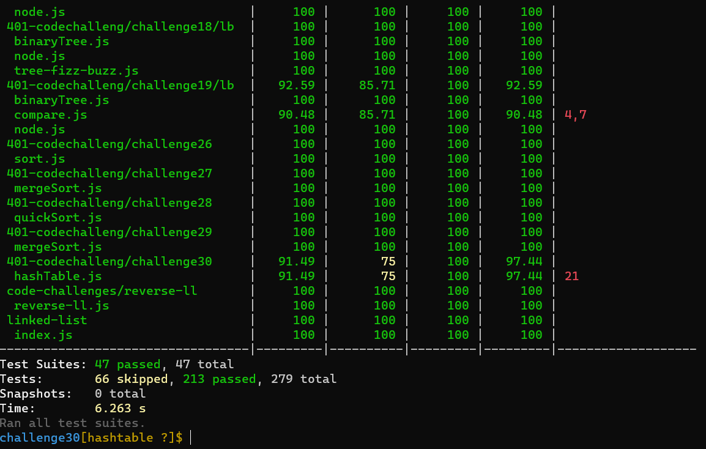

## Hashtables
*Hashtables : technique that is used to uniquely identify a specific object from a group of similar objects.*

*Hashtables are a data structure that utilize key value pairs. This means every Node or Bucket has both a key, and a value*

## Challenge
*implement HashTable class with 4 methods (add , hash , contains , get).*

## Approach & Efficiency
*Time : if the bucket has no collisions, Hash tables are O(1) average. this is the perfect hashing.*

*but however it suffers from O(n) in the collisions cases.*

*Space: complexity of O(n).*

## API
- add()

To add a new key-value pair to the hash table.
- get()

To check and return the value of the given key.
- contains()

To check if the key exists in the hash table and returns a boolian acordingly.
- hash()

Takes a key and convert it to an integer index.

## test 

